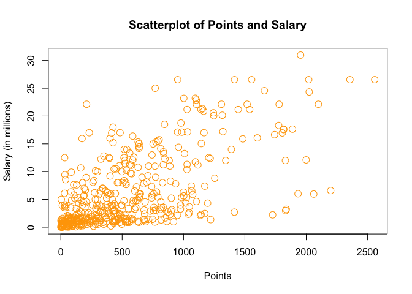

hw01-Jenny-Huang
================
Jenny Huang
9/15/2017

``` r
#load data file
load("data/nba2017-salary-points.RData")
#list the available objects
ls()
```

    ## [1] "experience" "player"     "points"     "points1"    "points2"   
    ## [6] "points3"    "position"   "salary"     "team"

Research Question
=================

1) A bit of data preporocessing
-------------------------------

``` r
#measure salary in millions
salary_m <- round(salary/1000000, digits = 2)
paste("$", format(salary_m)) 
```

    ##   [1] "$ 26.54" "$ 12.00" "$  8.27" "$  1.45" "$  1.41" "$  6.59" "$  6.29"
    ##   [8] "$  1.83" "$  4.74" "$  5.00" "$  1.22" "$  3.09" "$  3.58" "$  1.91"
    ##  [15] "$  8.00" "$  7.81" "$  0.02" "$  0.26" "$  0.27" "$  0.01" "$  9.70"
    ##  [22] "$ 12.80" "$  1.55" "$  0.54" "$ 21.17" "$  5.24" "$ 17.64" "$ 30.96"
    ##  [29] "$  2.50" "$ 15.33" "$  1.59" "$  7.33" "$  1.58" "$ 26.54" "$ 14.20"
    ##  [36] "$  0.54" "$  2.70" "$ 14.38" "$ 12.00" "$  1.92" "$  0.87" "$  5.30"
    ##  [43] "$  1.20" "$  6.05" "$ 12.25" "$  3.73" "$ 22.12" "$  1.20" "$  1.19"
    ##  [50] "$  0.54" "$ 15.94" "$  5.00" "$ 16.96" "$ 12.00" "$  7.40" "$  5.89"
    ##  [57] "$  0.54" "$  2.87" "$  3.39" "$  1.50" "$  2.71" "$ 23.18" "$  8.40"
    ##  [64] "$  0.39" "$ 15.73" "$  4.00" "$  2.50" "$  4.84" "$  1.02" "$ 20.07"
    ##  [71] "$  0.42" "$  3.85" "$  2.28" "$  3.00" "$ 17.10" "$  5.37" "$  1.55"
    ##  [78] "$ 12.52" "$ 15.20" "$  0.92" "$  9.61" "$  1.40" "$ 10.50" "$  1.81"
    ##  [85] "$  6.35" "$  2.57" "$  2.37" "$  2.70" "$ 10.23" "$  4.58" "$  0.65"
    ##  [92] "$  8.80" "$  1.05" "$  1.80" "$  4.00" "$  4.00" "$ 10.77" "$  2.46"
    ##  [99] "$ 18.31" "$  1.05" "$ 14.15" "$  3.49" "$  1.45" "$  2.11" "$  0.87"
    ## [106] "$  2.09" "$ 23.20" "$  1.02" "$  1.64" "$ 17.55" "$  1.71" "$  3.18"
    ## [113] "$  5.78" "$  0.75" "$ 14.00" "$ 13.22" "$  2.90" "$ 15.89" "$ 22.12"
    ## [120] "$  4.00" "$  5.78" "$  0.87" "$  2.59" "$  1.23" "$  0.21" "$  0.54"
    ## [127] "$  5.63" "$  4.00" "$  6.00" "$  1.02" "$ 22.12" "$  6.50" "$  1.55"
    ## [134] "$  7.00" "$  0.87" "$  1.70" "$  6.00" "$ 10.99" "$  3.68" "$  4.62"
    ## [141] "$  0.65" "$  2.26" "$ 14.96" "$  2.97" "$ 17.20" "$  1.05" "$  0.10"
    ## [148] "$  0.87" "$  5.32" "$  2.73" "$  6.51" "$  0.16" "$ 12.00" "$  6.33"
    ## [155] "$ 12.25" "$ 13.00" "$ 12.50" "$ 20.87" "$  6.00" "$  0.54" "$ 24.56"
    ## [162] "$  0.14" "$ 11.24" "$ 21.32" "$ 17.00" "$  1.02" "$  4.32" "$  3.90"
    ## [169] "$  6.19" "$  0.54" "$  0.54" "$  2.90" "$  0.54" "$  1.41" "$  1.38"
    ## [176] "$  4.35" "$ 17.00" "$  5.00" "$  7.25" "$  0.98" "$  2.61" "$ 17.00"
    ## [183] "$ 15.00" "$  6.54" "$  0.03" "$  3.91" "$ 11.75" "$  0.03" "$  0.95"
    ## [190] "$ 10.00" "$  0.03" "$  2.32" "$  9.00" "$  4.79" "$  9.42" "$  4.83"
    ## [197] "$  1.51" "$  2.99" "$  1.03" "$  1.02" "$  8.00" "$  0.09" "$  0.87"
    ## [204] "$  8.55" "$  1.33" "$  6.09" "$  0.12" "$ 21.17" "$  1.56" "$  1.07"
    ## [211] "$ 11.48" "$  0.98" "$  3.00" "$  3.33" "$  1.79" "$  2.50" "$  1.40"
    ## [218] "$  0.98" "$  0.73" "$  9.25" "$ 11.13" "$  1.17" "$  1.55" "$ 15.33"
    ## [225] "$  1.02" "$  0.98" "$  1.40" "$ 26.54" "$  1.18" "$ 16.66" "$  0.38"
    ## [232] "$  0.54" "$  5.78" "$ 12.11" "$  2.90" "$  0.54" "$ 10.00" "$  1.55"
    ## [239] "$  0.54" "$  1.18" "$  2.90" "$  0.17" "$  0.87" "$ 17.64" "$  1.19"
    ## [246] "$ 20.58" "$ 14.00" "$  3.58" "$ 15.50" "$ 14.45" "$  0.68" "$  0.54"
    ## [253] "$  1.30" "$ 12.39" "$  0.26" "$ 26.54" "$  0.54" "$  7.00" "$  1.00"
    ## [260] "$  6.00" "$ 18.74" "$  1.72" "$  7.81" "$  0.15" "$  1.32" "$ 11.00"
    ## [267] "$ 20.14" "$  1.55" "$  1.27" "$ 22.87" "$ 21.17" "$  0.54" "$  7.38"
    ## [274] "$ 13.25" "$  2.20" "$  1.40" "$  3.50" "$  1.55" "$  5.63" "$ 10.15"
    ## [281] "$  7.00" "$  3.94" "$ 11.05" "$  8.00" "$ 16.07" "$  1.02" "$  2.25"
    ## [288] "$ 11.00" "$  0.60" "$  0.94" "$  1.41" "$  2.12" "$  2.43" "$  2.34"
    ## [295] "$  5.99" "$  2.18" "$  2.44" "$  2.48" "$ 17.15" "$  0.98" "$  1.19"
    ## [302] "$  4.84" "$  3.75" "$  0.25" "$ 26.54" "$  0.54" "$  3.14" "$  8.95"
    ## [309] "$  6.55" "$  0.94" "$  5.70" "$ 22.12" "$  1.37" "$  2.90" "$  0.98"
    ## [316] "$  1.29" "$ 21.17" "$ 26.54" "$  5.51" "$  3.33" "$  4.26" "$  1.79"
    ## [323] "$  0.08" "$ 10.36" "$  7.68" "$ 18.50" "$  3.22" "$ 24.33" "$  6.67"
    ## [330] "$ 16.39" "$  0.60" "$  1.92" "$  8.99" "$  9.21" "$  2.75" "$  0.87"
    ## [337] "$  1.35" "$  0.54" "$ 15.05" "$  8.07" "$  3.24" "$  1.66" "$  3.21"
    ## [344] "$  4.54" "$  1.99" "$ 12.08" "$  1.63" "$  2.33" "$  3.50" "$  1.36"
    ## [351] "$  5.00" "$  3.53" "$ 11.20" "$  4.60" "$ 22.12" "$  0.02" "$  0.54"
    ## [358] "$  2.98" "$ 16.96" "$  0.58" "$  8.08" "$  0.17" "$ 11.29" "$  9.90"
    ## [365] "$  0.06" "$ 11.24" "$  2.09" "$  0.65" "$  1.02" "$  4.23" "$ 25.00"
    ## [372] "$  0.54" "$  8.38" "$ 22.12" "$  4.10" "$  0.06" "$  4.38" "$  0.54"
    ## [379] "$  0.87" "$  2.90" "$ 17.10" "$  0.21" "$  8.00" "$ 12.50" "$  4.01"
    ## [386] "$  3.52" "$  5.23" "$  8.00" "$  2.20" "$  8.05" "$  5.20" "$  1.44"
    ## [393] "$ 13.33" "$  1.19" "$  1.32" "$ 10.66" "$  3.55" "$  2.02" "$  6.01"
    ## [400] "$  3.50" "$  7.64" "$  2.35" "$  3.91" "$  5.96" "$  3.87" "$  3.80"
    ## [407] "$  0.14" "$ 13.55" "$  3.05" "$  1.34" "$  2.24" "$  5.28" "$  7.60"
    ## [414] "$  5.33" "$  0.07" "$  1.03" "$ 12.50" "$  3.27" "$  1.21" "$ 18.00"
    ## [421] "$  1.55" "$  5.44" "$  6.19" "$  1.05" "$ 16.00" "$  1.73" "$  0.87"
    ## [428] "$  4.82" "$ 12.61" "$  0.54" "$  2.22" "$  4.28" "$  0.02" "$ 14.00"
    ## [435] "$ 10.47" "$  4.00" "$  2.94" "$  0.28" "$  2.13" "$  0.92" "$ 12.41"

``` r
#creating experience as an integer vector
experience_int <- as.integer(replace(experience,grep("R",experience),"0"))

#creating position factor
position_fac <- factor(position)
levels(position_fac) <- list("center" = "C", "small_fwd" = "SF", "power_fwd" = "PF", "shoot_guard" = "SG", "point_guard" = "PG")

#frequencies for positions
table(position_fac)
```

    ## position_fac
    ##      center   small_fwd   power_fwd shoot_guard point_guard 
    ##          89          83          89          95          85

2) Scatterplot of Points and Salary
-----------------------------------

``` r
plot(points,salary_m, pch = 21,cex = 1.5, col = 'orange', xlab = 'Points', ylab = 'Salary (in millions)',main = "Scatterplot of Points and Salary")
```



3) Correlation between Points and Salary
----------------------------------------

``` r
# finding correlation between points and salary
n <- length(player)
points_mean <- sum(points)/n
salary_mean <- sum(salary_m)/n
points_var <- sum((points-points_mean)^2)/(n-1)
salary_var <- sum((salary_m - salary_mean)^2)/(n-1)
points_sd <- points_var^(1/2)
salary_sd <- salary_var^(1/2)
cov_ps <- sum((points - points_mean)*(salary_m - salary_mean))/(n -1)
cor_ps <- cov_ps/(points_sd*salary_sd)
```

4) Simple Linear Regression
---------------------------

``` r
b1 <- cor_ps * salary_sd / points_sd
b0 <- salary_mean - b1 * points_mean
y_hat <- b0 + b1 * points
summary(y_hat)
```

    ##    Min. 1st Qu.  Median    Mean 3rd Qu.    Max. 
    ##   1.509   2.844   5.206   6.187   8.184  23.399

#### Regression equation:

$\\hat{y}$= 1.51 + 0.01 \* points

#### Interpretation for slope coefficient b1:
For every extra point the player scores, his salary increases by 0.008558 million dollars.

#### Interpretation for intercept b0:
When the player doesn't score at all, his salary is 1.5091 million dollars.

#### Predicted salaries:

-   0 points: 1.51 million dollars
-   100 points: 2.51 million dollars
-   500 points: 6.51 million dollars
-   1000 points: 11.51 million dollars
-   2000 points: 21.51 million dollars

5) Plotting the regression line
-------------------------------

``` r
plot(points,salary_m, pch = 19, col = "grey", xlab = "Points", ylab = "Salary(in millions", main = "Regression and Lowess lines")

# adding regression line
abline(a = b0, b = b1, col = "blue", lwd = 3)
text(x = 2500, y = 25, label = "Regression", col = "blue")

# adding lowess line
lines(lowess(points,salary_m, f = 0.7), col = "red", lwd = 3)
text(x = 1500, y = 20, label = "Lowess", col = "red")
```


6) Regression residuals and Coefficient of Determination
--------------------------------------------------------

``` r
residuals <- salary_m - y_hat
summary(residuals)
```

    ##    Min. 1st Qu.  Median    Mean 3rd Qu.    Max. 
    ## -14.187  -2.792  -1.095   0.000   2.556  18.814

``` r
RSS <- sum(residuals^2)
TSS <- sum((salary_m - salary_mean)^2)
R_square <- 1 - RSS/TSS
```

RSS = 11300.45
TSS = 19005.91
R^2 = 0.41

7) Exploring Position and Experience
------------------------------------

``` r
plot(experience_int, salary_m, pch = 21, cex = 0.8, col = 'black',bg = "grey", xlab = 'Years of Experience', ylab = 'Salary (in millions)',main = "Scatterplot with lowess smooth")
lines(lowess(experience_int,salary_m, f = 0.7), col = "red", lwd = 3)
```


#### 3D Scatterplot

``` r
library(scatterplot3d)
scatterplot3d(points, experience_int, salary_m, ylab = "Experience", zlab = "Salary (in millions)", cex.symbols = 1.5, pch = 20, main = "3D Scatterplot", color = "orange")
```


#### Boxplot

``` r
boxplot(salary_m ~ position_fac, xlab = "Position", ylab = "Salary(in millions)")
```


#### Descriptions for plots

> The scatterplot describes the relation between experience and salary. The 3D graph describes the correlations among salary, points, and experience. The boxplot divides position into 5 different categories and draws the relation between salary and each position.

#### Relation between experience and salary

> It does not seem like there is much of a correlation between years of experience and salary, because the range of salaries corresponds to each year of experience is relatively similar. Although there are more players who are paid better with longer experience, it is not strong enough to conclude the correlation between salary and experience.

#### Boxplot and position and salary

> It doesn't look like position is related with salary. ALl positions have around the same average salary. There are more outliers for the four positions other than center, and center has the widest range of salary.

8) Comments and Reflections
---------------------------

-   Differentiate between factor and vector is still a little difficult because they are all very abstract and sometimes it's hard to visualize.
-   Plotting is relatively easy.
-   It is hard to memorize the git commands.
-   GitHub is easy to navigate, and I like that we can keep all our works saved online.
-   Yes, I need my friends to debug some of my codes, because a lot of times my logics were right but the syntax was wrong.
-   Around 4 hours.
-   The first part of changing position into factors and changing the names of the levels.
-   Not really. I feel like I learned a lot through this project.
-   Not being able to plot the 3d graph at first.
-   It was cool to visualize all the data through graphs.
