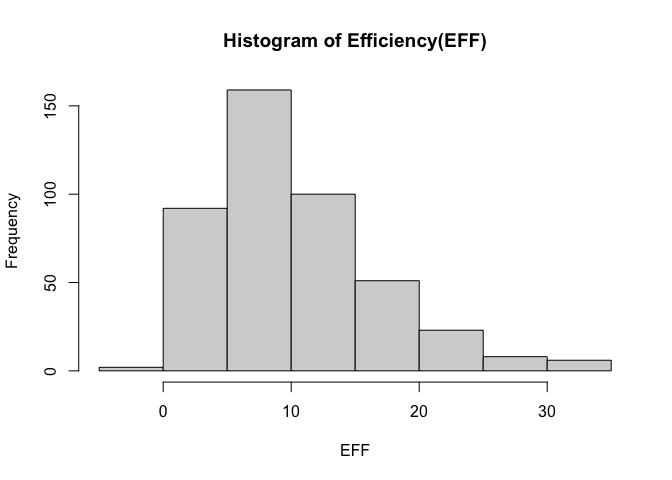
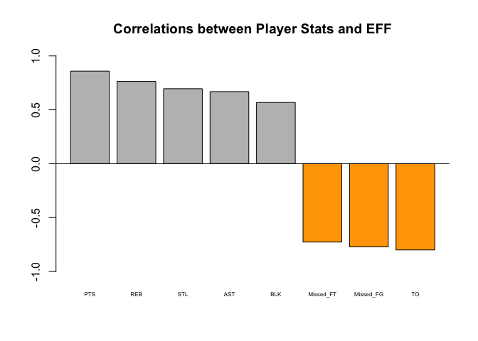
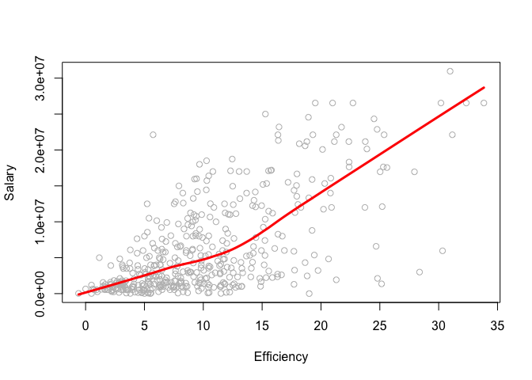
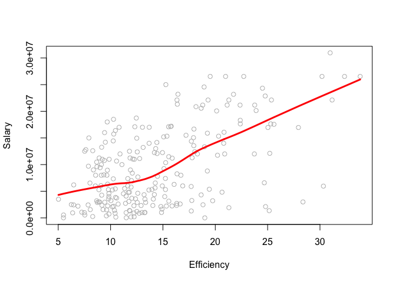

hw02-Jenny-Huang
================
Jenny Huang
9/27/2017

``` r
library(readr)
setwd("~/Desktop/stat133/stat133-hws-fall17/hw02")
```

2) Import the data in R
-----------------------

``` r
dat <- read.csv("./data/nba2017-player-statistics.csv", header = TRUE,
                  colClasses =c("Player" = "character",
                                "Team" = "character",
                                "Position" = "factor",
                                "Experience" = "character",
                                "Salary" = "real"
                                ))
str(dat)
```

    ## 'data.frame':    441 obs. of  24 variables:
    ##  $ Player      : chr  "Al Horford" "Amir Johnson" "Avery Bradley" "Demetrius Jackson" ...
    ##  $ Team        : chr  "BOS" "BOS" "BOS" "BOS" ...
    ##  $ Position    : Factor w/ 5 levels "C","PF","PG",..: 1 2 5 3 4 3 4 5 4 2 ...
    ##  $ Experience  : chr  "9" "11" "6" "R" ...
    ##  $ Salary      : num  26540100 12000000 8269663 1450000 1410598 ...
    ##  $ Rank        : int  4 6 5 15 11 1 3 13 8 10 ...
    ##  $ Age         : int  30 29 26 22 31 27 26 21 20 29 ...
    ##  $ GP          : int  68 80 55 5 47 76 72 29 78 78 ...
    ##  $ GS          : int  68 77 55 0 0 76 72 0 20 6 ...
    ##  $ MIN         : int  2193 1608 1835 17 538 2569 2335 220 1341 1232 ...
    ##  $ FGM         : int  379 213 359 3 95 682 333 25 192 114 ...
    ##  $ FGA         : int  801 370 775 4 232 1473 720 58 423 262 ...
    ##  $ Points3     : int  86 27 108 1 39 245 157 12 46 45 ...
    ##  $ Points3_atts: int  242 66 277 1 111 646 394 35 135 130 ...
    ##  $ Points2     : int  293 186 251 2 56 437 176 13 146 69 ...
    ##  $ Points2_atts: int  559 304 498 3 121 827 326 23 288 132 ...
    ##  $ FTM         : int  108 67 68 3 33 590 176 6 85 26 ...
    ##  $ FTA         : int  135 100 93 6 41 649 217 9 124 37 ...
    ##  $ OREB        : int  95 117 65 2 17 43 48 6 45 60 ...
    ##  $ DREB        : int  369 248 269 2 68 162 367 20 175 213 ...
    ##  $ AST         : int  337 140 121 3 33 449 155 4 64 71 ...
    ##  $ STL         : int  52 52 68 0 9 70 72 10 35 26 ...
    ##  $ BLK         : int  87 62 11 0 7 13 23 2 18 17 ...
    ##  $ TO          : int  116 77 88 0 25 210 79 4 68 39 ...

``` r
# importing data with read_csv()
read_csv("./data/nba2017-player-statistics.csv",
                  col_types = list(.default = col_integer(),
                                   Player = col_character(), 
                                   Team = col_character(), 
                                   Experience = col_character(),
                                   Position = col_factor(c("C","PF","PG","SF","SG")),
                                   Salary = col_double()))
```

    ## # A tibble: 441 x 24
    ##               Player  Team Position Experience   Salary  Rank   Age    GP
    ##                <chr> <chr>   <fctr>      <chr>    <dbl> <int> <int> <int>
    ##  1        Al Horford   BOS        C          9 26540100     4    30    68
    ##  2      Amir Johnson   BOS       PF         11 12000000     6    29    80
    ##  3     Avery Bradley   BOS       SG          6  8269663     5    26    55
    ##  4 Demetrius Jackson   BOS       PG          R  1450000    15    22     5
    ##  5      Gerald Green   BOS       SF          9  1410598    11    31    47
    ##  6     Isaiah Thomas   BOS       PG          5  6587132     1    27    76
    ##  7       Jae Crowder   BOS       SF          4  6286408     3    26    72
    ##  8       James Young   BOS       SG          2  1825200    13    21    29
    ##  9      Jaylen Brown   BOS       SF          R  4743000     8    20    78
    ## 10     Jonas Jerebko   BOS       PF          6  5000000    10    29    78
    ## # ... with 431 more rows, and 16 more variables: GS <int>, MIN <int>,
    ## #   FGM <int>, FGA <int>, Points3 <int>, Points3_atts <int>,
    ## #   Points2 <int>, Points2_atts <int>, FTM <int>, FTA <int>, OREB <int>,
    ## #   DREB <int>, AST <int>, STL <int>, BLK <int>, TO <int>

``` r
str(read_csv("./data/nba2017-player-statistics.csv",
                  col_types = list(.default = col_integer(),
                                   Player = col_character(), 
                                   Team = col_character(), 
                                   Experience = col_character(),
                                   Position = col_factor(c("C","PF","PG","SF","SG")),
                                   Salary = col_double())))
```

    ## Classes 'tbl_df', 'tbl' and 'data.frame':    441 obs. of  24 variables:
    ##  $ Player      : chr  "Al Horford" "Amir Johnson" "Avery Bradley" "Demetrius Jackson" ...
    ##  $ Team        : chr  "BOS" "BOS" "BOS" "BOS" ...
    ##  $ Position    : Factor w/ 5 levels "C","PF","PG",..: 1 2 5 3 4 3 4 5 4 2 ...
    ##  $ Experience  : chr  "9" "11" "6" "R" ...
    ##  $ Salary      : num  26540100 12000000 8269663 1450000 1410598 ...
    ##  $ Rank        : int  4 6 5 15 11 1 3 13 8 10 ...
    ##  $ Age         : int  30 29 26 22 31 27 26 21 20 29 ...
    ##  $ GP          : int  68 80 55 5 47 76 72 29 78 78 ...
    ##  $ GS          : int  68 77 55 0 0 76 72 0 20 6 ...
    ##  $ MIN         : int  2193 1608 1835 17 538 2569 2335 220 1341 1232 ...
    ##  $ FGM         : int  379 213 359 3 95 682 333 25 192 114 ...
    ##  $ FGA         : int  801 370 775 4 232 1473 720 58 423 262 ...
    ##  $ Points3     : int  86 27 108 1 39 245 157 12 46 45 ...
    ##  $ Points3_atts: int  242 66 277 1 111 646 394 35 135 130 ...
    ##  $ Points2     : int  293 186 251 2 56 437 176 13 146 69 ...
    ##  $ Points2_atts: int  559 304 498 3 121 827 326 23 288 132 ...
    ##  $ FTM         : int  108 67 68 3 33 590 176 6 85 26 ...
    ##  $ FTA         : int  135 100 93 6 41 649 217 9 124 37 ...
    ##  $ OREB        : int  95 117 65 2 17 43 48 6 45 60 ...
    ##  $ DREB        : int  369 248 269 2 68 162 367 20 175 213 ...
    ##  $ AST         : int  337 140 121 3 33 449 155 4 64 71 ...
    ##  $ STL         : int  52 52 68 0 9 70 72 10 35 26 ...
    ##  $ BLK         : int  87 62 11 0 7 13 23 2 18 17 ...
    ##  $ TO          : int  116 77 88 0 25 210 79 4 68 39 ...
    ##  - attr(*, "spec")=List of 2
    ##   ..$ cols   :List of 24
    ##   .. ..$ Player      : list()
    ##   .. .. ..- attr(*, "class")= chr  "collector_character" "collector"
    ##   .. ..$ Team        : list()
    ##   .. .. ..- attr(*, "class")= chr  "collector_character" "collector"
    ##   .. ..$ Position    :List of 3
    ##   .. .. ..$ levels    : chr  "C" "PF" "PG" "SF" ...
    ##   .. .. ..$ ordered   : logi FALSE
    ##   .. .. ..$ include_na: logi FALSE
    ##   .. .. ..- attr(*, "class")= chr  "collector_factor" "collector"
    ##   .. ..$ Experience  : list()
    ##   .. .. ..- attr(*, "class")= chr  "collector_character" "collector"
    ##   .. ..$ Salary      : list()
    ##   .. .. ..- attr(*, "class")= chr  "collector_double" "collector"
    ##   .. ..$ Rank        : list()
    ##   .. .. ..- attr(*, "class")= chr  "collector_integer" "collector"
    ##   .. ..$ Age         : list()
    ##   .. .. ..- attr(*, "class")= chr  "collector_integer" "collector"
    ##   .. ..$ GP          : list()
    ##   .. .. ..- attr(*, "class")= chr  "collector_integer" "collector"
    ##   .. ..$ GS          : list()
    ##   .. .. ..- attr(*, "class")= chr  "collector_integer" "collector"
    ##   .. ..$ MIN         : list()
    ##   .. .. ..- attr(*, "class")= chr  "collector_integer" "collector"
    ##   .. ..$ FGM         : list()
    ##   .. .. ..- attr(*, "class")= chr  "collector_integer" "collector"
    ##   .. ..$ FGA         : list()
    ##   .. .. ..- attr(*, "class")= chr  "collector_integer" "collector"
    ##   .. ..$ Points3     : list()
    ##   .. .. ..- attr(*, "class")= chr  "collector_integer" "collector"
    ##   .. ..$ Points3_atts: list()
    ##   .. .. ..- attr(*, "class")= chr  "collector_integer" "collector"
    ##   .. ..$ Points2     : list()
    ##   .. .. ..- attr(*, "class")= chr  "collector_integer" "collector"
    ##   .. ..$ Points2_atts: list()
    ##   .. .. ..- attr(*, "class")= chr  "collector_integer" "collector"
    ##   .. ..$ FTM         : list()
    ##   .. .. ..- attr(*, "class")= chr  "collector_integer" "collector"
    ##   .. ..$ FTA         : list()
    ##   .. .. ..- attr(*, "class")= chr  "collector_integer" "collector"
    ##   .. ..$ OREB        : list()
    ##   .. .. ..- attr(*, "class")= chr  "collector_integer" "collector"
    ##   .. ..$ DREB        : list()
    ##   .. .. ..- attr(*, "class")= chr  "collector_integer" "collector"
    ##   .. ..$ AST         : list()
    ##   .. .. ..- attr(*, "class")= chr  "collector_integer" "collector"
    ##   .. ..$ STL         : list()
    ##   .. .. ..- attr(*, "class")= chr  "collector_integer" "collector"
    ##   .. ..$ BLK         : list()
    ##   .. .. ..- attr(*, "class")= chr  "collector_integer" "collector"
    ##   .. ..$ TO          : list()
    ##   .. .. ..- attr(*, "class")= chr  "collector_integer" "collector"
    ##   ..$ default: list()
    ##   .. ..- attr(*, "class")= chr  "collector_integer" "collector"
    ##   ..- attr(*, "class")= chr "col_spec"

3) Right after importing the data
---------------------------------

``` r
#converting 'experience' into integers and replacing "R" with 1.
dat$Experience <- as.integer(replace(dat$Experience,grep("R",dat$Experience),"0"))
```

4) Performance of players
-------------------------

``` r
dat$Missed_FG <- dat$FGA - dat$FGM
dat$Missed_FG
```

    ##   [1]  422  157  416    1  137  791  387   33  231  148   19  248  480  260
    ##  [15]   80  282    5   79   53    1  288  233   48   96  497  138  749  608
    ##  [29]  190  175   10  362   67  824  329   72   48  311  492   53  279   76
    ##  [43]  102  230  151  127  685   77    1   15   46  155  788  284  483  389
    ##  [57]   45   85  139   51  667  225  133   34  426  127  243   73  167  542
    ##  [71]   20  221  497  603  339  415  138  150  183  345  326  190  262   99
    ##  [85]   29   98  295  179  236  366   27  507   46   89   26   91  310  425
    ##  [99]  727   24  325   17  192   42   94  186  541  110  173  682   55  194
    ## [113]  367  133  332  393  382  590  431  401   74  311  145  168   54  270
    ## [127]  467   12  324  123  428  136  105   60   79   41  420  336  558  586
    ## [141]    9   74  393  236  552   76   26   11  190  482  265    7  806  351
    ## [155]  407  323   10  582  163   21  787   44  383  517  102  305  542  198
    ## [169]  147   14   47  211  135   94  219  472  160  152  322   57  482  522
    ## [183]  338  153    5  213  548    7   21  152   29  546  319  229   21  229
    ## [197]   87  383  182  440  326   48  276   17  216   21   27  617  209  304
    ## [211]  225  208  205   55   88  207  307  430  168  286  196    8  117  378
    ## [225]  222   55  111  475   51  732   52  139  143  768  143   63  273  172
    ## [239]  131   66   98    6  244  675  116  549  268  349  301  304   37    2
    ## [253]  201  604    6  859   10  162  120  315  450  226  472   22   50  408
    ## [267]  492   79    5  411  165   10  494  510  187  304   42  293  127  149
    ## [281]  181  209  214  317  611   48  247  353    7   50  394  210  211  280
    ## [295]  207  248  289   68  335  165    5   49    9   36 1117  146  281   90
    ## [309]  520  243   52  147   23  175  250   93  628  545  321  310  297   79
    ## [323]   30  531  283  344  749  827   67  317   63  116  310  232  140   35
    ## [337]  110   16  415  120  343  316  434  336  122  187   40   82   14  362
    ## [351]    1  372  507   89  757    3   40  185  172   81  336  113  489   34
    ## [365]   19  294  241   25    3  205  382  209  183  681  201   22   57   89
    ## [379]   49  365  514  203  196  235  239  154  374  249   46  176   62   40
    ## [393]  241  101  285   84  226   31  861  117   41  329    8  677  195  205
    ## [407]   20  389  310  106  384  410   68  516   34  112  594  396  171  260
    ## [421]   49  361  144   91  159   79  129  233  316   53  825  104    6  585
    ## [435]  189  220  348   20  411  253   75

``` r
dat$Missed_FT <- dat$FTA - dat$FTM
dat$Missed_FT
```

    ##   [1]  27  33  25   3   8  59  41   3  39  11   6  33  47  15  17  11   1
    ##  [18]   4  12   1  19   5   7  14  38   1  31 173  28 107   0  28  13 102
    ##  [35]  28   4  26  41  66  23  33   5  10  17   4   5  60   5   1   2  32
    ##  [52]  16 105  56  35  20   4  10   7  10  37 198  13   1  49  18  18   4
    ##  [69]  15  94   1  20  50 141  62  56   5  33  11  17  14  27  10   3   4
    ##  [86]  17  11   8  20   9   0  55   4   8   1  10  35  58  38   8  41   0
    ## [103]  20   3  33   4  58   3   8  91   6  19  29   9  20  29  45  79 133
    ## [120]  63   3  17  18   4   2  27  59   6   6  39 218  15   2  11   7   4
    ## [137]  30  15  31  40   0   2  18  17  36   6   4   4  63  38  19   1  55
    ## [154]  18  19  42   1  41  27   5  61   2  13  32  44  14  54  19   8  11
    ## [171]   7  13  15   7  34  61 109   9  30   0  65  54  23   9   1  10  53
    ## [188]   0   2   4   2  48  32  52   1  53   9  28  31  31   9  16  17   2
    ## [205]  18   0   9  69  26  22  26  14  13   5  14   9  63  38  33  36  30
    ## [222]   7  13  62  14  21  55  48  13  32   3   8  18  37  28   1   5  33
    ## [239]   6   9  28   3  33  64  12  51  21  14  54  32   0   0  83  28   1
    ## [256] 135   1  15  45  22  21  30  33   1   4  59 101  11   0  28 220   0
    ## [273]  22  29  28  17   3  14   6  18   9  15  42  39  67  12  18  14   3
    ## [290]   1  25 165  24  22   5  64  23   5  61  53   1   4   3   2 130  14
    ## [307] 100  11  38  46  12   8   8  24  33  10  54  52  50  11  27   6   6
    ## [324]  52  40  19  26  57  31  18   4  33  47   5  34   2  11   3  38   3
    ## [341]  36  30  14  18  19  58   2  29   0  40   0  47  53  11 128   0   6
    ## [358]  11  27  24  17   6  49  16   1  25  31  11   1  22  14  15  34  39
    ## [375]   7   2  14   5  25  15  33   9  21  10  23   8  24  16   2  24   1
    ## [392]   4  20  22  44  10  50   5 130   5   7  31   0  72  23  16   3  31
    ## [409]  43  10  23  81   6  41  14  17  34  78  21  17   6  13  27  35  15
    ## [426]   3  42  58  22  12  74   7   1  70  22   5  68   1  35  16  33

``` r
dat$PTS <- 3 * dat$Points3 + 2 * dat$Points2 + dat$FTM 
dat$PTS
```

    ##   [1]  952  520  894   10  262 2199  999   68  515  299   38  678  835  410
    ##  [15]  178  676    9  179  156    6  567  351  132  166 1142  373 1816 1954
    ##  [29]  448  630   14  740  150 2020  638  107  165  959 1344  253  636  139
    ##  [43]  229  445  327  330 1779   81    1   24  173  420 1805  883 1063 1075
    ##  [57]   90  154  285  101 1414 1002  270   61  801  257  391  169  435 1246
    ##  [71]   25  444 1143 1832  951 1025  307  392  426  767  577  528  451  142
    ##  [85]   83  226  683  322  535  815   21 1254   68  232   43  177  630 1173
    ##  [99] 1775   59  814   41  437   54  316  291 1096  181  370 1816   89  297
    ## [113]  744  240  538  839  729 1483 1309  975  107  539  196  324   98  497
    ## [127] 1002   31  648  374 1105  365  227  191  127   60  758  767 1047 1105
    ## [141]    4  141  752  339 1321  142   50   35  639  874  603   18 1830  780
    ## [155]  849  743   31 1164  312   57 1659   95  835 1154  232  629 1196  496
    ## [169]  275   40   98  425  215  124  587 1019  483  281  616   82 1046 1167
    ## [183]  638  327   14  317 1096    0   23  299   64 1040  662  590   33  627
    ## [197]  203  756  559  864  530  148  556   39  445   30   95 1539  468  543
    ## [211]  523  428  442  126  209  357  675  919  432  709  574   19  316  776
    ## [225]  527  147  472 1555  135 1742  114  282  389 1999  426   94  497  576
    ## [239]  303  130  387   25  483 1888  246 1243  517  759  792  638   62   14
    ## [253]  818 1217    3 2356   13  343  527  639  979  504  936   58   86  889
    ## [267] 1316  292    4 1104 1029   10 1173 1008  484  711   81  538  186  283
    ## [281]  338  412  476  829 1601  146  581  715   22  100  748 1137  430  440
    ## [295]  406  522  479  145 1033  421   14   88   33   43 2558  183  905  207
    ## [309] 1067  425  189  210   58  429  689  165 1446 1415  643  551  586  106
    ## [323]   55 1028  532  845 1837 2024  200  586   78  304  773  401  327   98
    ## [337]  218   31 1145  262  603  851  811  687  305  587   83  245   28 1221
    ## [351]    4  820 1117  207 2099   11   87  435  414  150  700  267 1029   85
    ## [365]   52  563  464   48    8  437  769  350  516 1518  381   40  188  150
    ## [379]  213  898  986  408  461  515  495  378  900  506  124  470  114   79
    ## [393]  562  289  681  163  611   63 1933  197  105  816   12 2061  293  403
    ## [407]   45  836  772  209  889  740  129  984  120  284 1205  975  449  425
    ## [421]   57  791  383  241  401  170  346  613  595  168 1726  146    3 1390
    ## [435]  434  419  753   14  951  444  397

``` r
dat$REB <- dat$OREB + dat$DREB
dat$REB
```

    ##   [1]  464  365  334    4   85  205  415   26  220  273   34  360  306  227
    ##  [15]  124  290    2   45   57   10  219  113   38   41  666   97  230  640
    ##  [29]  202  716   10  236   48  386  275   42  165  759  287  243  168  129
    ##  [43]  186  291  156   80  239   44    2   22  150  258  326  849  492  515
    ##  [57]   34   83   47   59  248  940  151   32  231  206  124   68  240  533
    ##  [71]   18  270  224  700  532  314  106  295  123  213  147  193  162   49
    ##  [85]   45  114  248   69  278  229   17  331   17  142   24  220  204  587
    ##  [99]  492   56  449    2  295   17  311  151  271   49  111  470   68  152
    ## [113]  384  125  355  520  154  278 1088  375   74  168   94  142   82  257
    ## [127]  293   36  133  332 1116  333   57  130   33   41  235  402  248  366
    ## [141]    3   64  113  189  416   39   22   29  405  336  264    8  308  178
    ## [155]  498  565   42  481   73   22  436   27  260  246  402  225  475  439
    ## [169]  142   51   64  126   98   59  502  405  567   89  117   25  387  209
    ## [183]  214   77    9  146  779    7   35   68   29  514  185  240   12  243
    ## [197]   96  226  311  436  157   85  251   22  148   27   28  403  188  184
    ## [211]  135  147  262   52  107  155  452  280  164  570  304   23  203  599
    ## [225]  122   90  244  513  124  285   91  101  151  353  410   23  224  440
    ## [239]   99   42  495   31  160  430  208  524  157  142  501  113    6   10
    ## [253]  526  201    3  659   10   70  219  394  330  284  459   24   24  161
    ## [267]  496  129    3  304 1114    6  171  129  174  373   48  217  181  120
    ## [281]  158  132  305  167  393  121  260  242   17   30  202 1035  128  235
    ## [295]   86  402  287   49  482  199    9   48   30   11  864   88  615  103
    ## [309]  291  136   78   84   60  259  544  162  462  242  391  100  227   46
    ## [323]   11  598  451  225  291  368  243  247   24  207  341  236  387   52
    ## [337]   61   14  326  112  180  178  214  192  187  459   17  173   39  715
    ## [351]    2  259  460  177  886    1   73  277  212  101  152   34  264  163
    ## [365]    4  307  173   36    7  127  353  221  307  397   84   22  150   95
    ## [379]  308  178  259   99  239  125  130  103  153  183   86  403   35   23
    ## [393]  190  162  179   51  340   33  329   99  158  647   14 1007  166  244
    ## [407]   20  305  220   67  159  317   52  222   62  159  246  636  369  295
    ## [421]   20  137  342  223  264   27  292  510  118   79  249  103    6  320
    ## [435]  225  104  348   11  339   95  539

``` r
dat$MPG <- dat$MIN/dat$GP
dat$MPG
```

    ##   [1] 32.250000 20.100000 33.363636  3.400000 11.446809 33.802632 32.430556
    ##   [8]  7.586207 17.192308 15.794872  5.640000 20.506667 30.367089 17.067568
    ##  [15] 10.294118 18.891892 12.000000 20.250000 17.080000 24.000000 25.486842
    ##  [22] 28.951220  7.937500  9.190476 31.416667 24.542857 35.069444 37.756757
    ##  [29] 20.430380 29.948718  4.444444 25.037500 16.518519 35.405405 26.138889
    ##  [36]  7.945946 11.592593 25.825000 37.400000 19.087719 18.000000 25.375000
    ##  [43] 15.618182 24.600000 30.956522 23.115385 34.857143 16.260870  4.000000
    ##  [50]  3.947368 17.903226 14.432432 36.358974 31.170732 31.236842 32.562500
    ##  [57]  9.566667 12.614035 12.333333  9.763158 31.455696 29.716216 24.346154
    ##  [64] 14.529412 26.890411 12.303571 17.095890 15.833333 17.671429 33.956522
    ##  [71]  6.875000 25.741935 27.265823 35.562500 22.506173 33.882353 18.445946
    ##  [78] 19.362069 30.655172 26.426667 26.131579 16.696429 16.185714 11.170732
    ##  [85]  9.000000  9.859649 29.200000 13.753846 14.106061 23.368421  4.043478
    ##  [92] 32.402439  4.090909 11.408163 22.000000 14.278689 27.000000 31.370370
    ##  [99] 35.853333  7.551724 30.229730  9.666667 15.625000 12.909091 15.757576
    ## [106] 17.122807 29.866667 15.179487 16.317460 36.960526 12.050000 18.800000
    ## [113] 23.985714 19.159091 26.710145 28.037037 30.086957 33.684932 32.636364
    ## [120] 27.434211 17.318182 30.452830 34.722222 15.661765 13.457143 25.205128
    ## [127] 29.835616  7.647059 24.193548 14.521127 29.740741 15.506667 14.358974
    ## [134]  8.371429  9.769231  7.684211 24.135802 25.920000 33.276316 32.468354
    ## [141]  3.555556 15.064516 27.384615 17.805195 31.304878 10.146341 12.230769
    ## [148]  8.230769 27.822581 26.053333 18.435484  8.500000 34.670886 24.027027
    ## [155] 30.197368 29.000000 13.384615 33.987013 16.220000  7.000000 34.297297
    ## [162] 12.500000 31.935065 32.531250 22.065217 19.987805 32.787879 15.556962
    ## [169] 21.043478  8.095238 10.343750 14.941176 16.480769  9.714286 18.388889
    ## [176] 28.725000 22.135802 16.322581 19.717949  6.977778 29.414634 32.852941
    ## [183] 22.231884 20.500000  9.600000 14.769231 28.840000  8.600000  5.684211
    ## [190] 31.166667 26.166667 26.283951 23.152778 22.680000 23.666667 25.354839
    ## [197] 21.583333 27.350000 20.929825 31.626866 22.323529 13.000000 26.333333
    ## [204]  9.500000 17.246377 11.100000 15.333333 29.626667 21.701754 22.506849
    ## [211] 24.527778 21.884615 18.390625 14.650000 15.937500 18.608696 22.576923
    ## [218] 25.057143 22.610169 24.704225 26.289474  8.500000 12.558824 32.513158
    ## [225] 14.766234  8.788462  9.597403 33.387097  8.433962 33.961538 20.500000
    ## [232] 15.126761 17.697368 33.392405 18.114286  7.916667 26.573529 18.696203
    ## [239] 12.059701  8.473684 17.500000  6.421053 17.846154 33.432432 14.166667
    ## [246] 32.430556 18.710145 21.925000 25.421875 25.190476  4.920000 10.400000
    ## [253] 23.861538 30.973333 13.000000 36.382716  3.142857 25.695652 18.344828
    ## [260] 30.716418 29.388889 18.428571 34.662500 23.166667 10.266667 27.756757
    ## [267] 34.032787 11.096154  3.000000 31.491803 31.728395  3.428571 28.179487
    ## [274] 26.304878 22.337500 15.682927 11.080000 21.250000 11.911765 15.547619
    ## [281] 17.575342 18.606061 23.720000 31.510204 34.465753  8.470588 24.048780
    ## [288] 23.628205  4.416667  8.650000 27.000000 33.876543 21.909091 16.309859
    ## [295] 15.514706 30.075949 20.148148 19.545455 21.291667 19.102564 15.500000
    ## [302] 12.031250  6.400000  9.615385 34.592593 15.203125 29.862500 21.173913
    ## [309] 33.164179 20.472222 15.964286 19.852941  6.611111 23.453125 27.285714
    ## [316] 13.285714 34.202703 33.217391 26.957746 17.656716 24.643836 12.272727
    ## [323] 17.181818 24.465753 29.065574 28.531646 34.950000 35.920000 17.152174
    ## [330] 25.507692  7.114286 29.200000 28.870130 16.513514 17.094595  8.102564
    ## [337]  9.660377  5.000000 33.873016 15.585366 25.563636 31.263158 21.512195
    ## [344] 27.266667 13.580645 21.245902  7.500000 23.407407  7.550000 27.917808
    ## [351]  1.833333 28.416667 30.943662 14.974359 36.106667 20.500000 11.705882
    ## [358] 24.984848 33.764706 14.088235 24.931507 23.263158 32.686567 15.548387
    ## [365] 12.333333 29.675000 23.461538  7.409091 25.000000 16.723077 26.370370
    ## [372] 20.271605 17.311688 35.481013 22.028571 12.777778 21.954545  9.648148
    ## [379] 12.397260 28.985714 34.178082 29.055556 22.723077 25.901639 19.278689
    ## [386] 29.080000 30.338235 26.584615 16.136364 19.985915 19.736842  9.000000
    ## [393] 33.766667 18.545455 25.101449 22.428571 18.946667  7.500000 37.170732
    ## [400] 21.914894  8.564516 32.353659  6.714286 36.951220 17.089744 18.307692
    ## [407] 17.076923 32.920000 19.435897 12.900000 37.212766 28.848101 14.916667
    ## [414] 28.746032 19.850000 16.026316 29.231707 28.810811 22.888889 26.535714
    ## [421]  6.400000 25.933333 16.283582 11.666667 20.444444 17.818182 15.063830
    ## [428] 20.259740 21.111111 17.031250 35.000000 13.348837 11.500000 32.969697
    ## [435] 21.281250 14.373134 21.256098  9.571429 31.030303 18.409836 27.617021

``` r
dat$EFF <- (dat$PTS + dat$REB + dat$AST + dat$STL + dat$BLK - dat$Missed_FG - dat$Missed_FT -dat$TO) / dat$GP
dat$EFF
```

    ##   [1] 19.5147059 10.9000000 16.3454545  2.6000000  4.8085106 24.6842105
    ##   [7] 16.0694444  2.4137931  6.5897436  6.2564103  2.1600000 11.7466667
    ##  [13] 12.3797468  6.7837838  5.0000000  9.9324324  5.0000000  8.2916667
    ##  [19]  6.2000000 19.0000000  7.8815789  7.6341463  2.8333333  3.5476190
    ##  [25] 22.3666667 10.1714286 22.3888889 30.9729730  6.2531646 15.3846154
    ##  [31]  2.1111111 10.2625000  6.9629630 22.7162162  9.5000000  3.0270270
    ##  [37]  5.1296296 17.7125000 23.7333333  9.7894737  7.4868421  9.7916667
    ##  [43]  6.5090909  9.0769231 14.9565217 10.5769231 19.3116883  6.2608696
    ##  [49]  0.5000000  1.6315789  9.2580645  7.5945946 25.0256410 18.2926829
    ##  [55] 15.2368421 17.7000000  3.1666667  4.0000000  4.4561404  3.2631579
    ##  [61] 16.3164557 21.7432432 12.0769231  4.9411765 10.3013699  6.3392857
    ##  [67]  5.3698630  6.3333333  8.6285714 20.1304348  2.1875000 10.4677419
    ##  [73] 12.2278481 28.3750000 15.5432099 19.4313725  5.3648649 10.6034483
    ##  [79] 15.0689655 12.2400000  8.6973684  9.7500000  5.3857143  3.0975610
    ##  [85]  5.8421053  4.6842105  9.1750000  4.5692308  9.3333333  9.8421053
    ##  [91]  0.6086957 19.2439024  1.4848485  6.0816327  9.8333333  6.0000000
    ##  [97]  9.4054054 18.8271605 22.3866667  3.0344828 14.4189189  3.7777778
    ## [103]  8.5156250  2.9090909  8.3030303  5.3157895 16.4333333  4.0256410
    ## [109]  6.8412698 25.6052632  5.3000000  7.6444444 11.9571429  5.6818182
    ## [115] 13.6811594 13.1111111 13.3478261 19.2465753 25.3636364 15.1710526
    ## [121]  6.5909091 10.4339623 10.7222222  4.9558824  4.2000000  7.5384615
    ## [127] 14.2465753  3.1176471  8.5483871  8.5070423 21.2962963  7.8000000
    ## [133]  7.2820513  7.6285714  2.3589744  2.6842105 11.6419753 12.2666667
    ## [139] 12.0263158 12.5949367  0.0000000  5.4516129 12.5000000  5.0519481
    ## [145] 15.7926829  3.2926829  4.7692308  4.0769231 15.2419355 11.4266667
    ## [151] 10.7741935  4.7500000 20.8987342  9.7162162 14.1842105 14.3086420
    ## [157]  5.2307692 18.1558442  6.1400000  2.3333333 18.9324324  5.2777778
    ## [163] 11.8571429 16.3750000 13.0434783  8.1341463 18.6515152 11.3797468
    ## [169]  6.4782609  3.4285714  3.9687500  5.6617647  4.9230769  3.1666667
    ## [175] 12.6250000 13.2000000 10.8148148  5.1774194  6.8205128  1.6444444
    ## [181] 16.6463415 13.6911765  7.9275362  8.0277778  3.8000000  4.4307692
    ## [187] 20.2133333 -0.6000000  2.2631579 11.0833333 11.5000000 12.9135802
    ## [193]  8.3611111 11.7000000  9.0000000 20.6451613  9.6250000  8.8625000
    ## [199] 13.2807018 14.8656716  9.1176471 10.3888889 12.7407407  5.2500000
    ## [205]  5.8405797  3.8000000  8.6666667 18.8000000  9.2807018  7.2465753
    ## [211] 15.5555556  7.5000000  8.9062500  6.5000000  7.5625000  5.7246377
    ## [217] 11.8076923 11.4857143  9.8474576 15.0985915 12.7763158  2.6000000
    ## [223]  8.1176471 20.3157895  6.4285714  3.9615385  7.9610390 30.1935484
    ## [229]  4.4905660 17.9615385  9.6000000  4.5633803  6.7763158 25.2025316
    ## [235] 11.4428571  1.8333333  9.1176471 11.6962025  4.8805970  3.1842105
    ## [241] 11.0131579  2.8421053  6.2564103 25.2972973  6.3194444 18.6527778
    ## [247]  8.2608696  9.8125000 17.2031250 10.2539683  1.6400000  5.0000000
    ## [253] 17.7076923 12.5466667  1.0000000 32.3456790  0.9285714 12.0000000
    ## [259] 11.4310345 14.9402985 12.4583333  8.1298701 14.4750000 10.5000000
    ## [265]  2.1000000  9.8648649 23.9016393  6.6923077  1.6666667 24.7704918
    ## [271] 23.7654321  0.7142857 11.6410256  9.1463415  6.8875000 10.0487805
    ## [277]  3.4800000  8.0625000  4.3823529  6.0476190  5.6986301  5.8333333
    ## [283] 12.1200000 16.7142857 20.8356164  4.8627451  9.7195122  9.2051282
    ## [289]  2.6666667  3.1000000 10.3728814 24.8024691  7.8545455  5.9859155
    ## [295]  4.8823529 10.2911392  6.4691358  5.9545455 15.7361111  6.6025641
    ## [301] 11.5000000  2.9062500  3.1500000  2.3846154 33.8395062  3.6250000
    ## [307] 15.5625000  9.6956522 14.2686567  6.3750000  8.5357143  5.7352941
    ## [313]  2.8055556  8.7343750 13.2467532  5.4761905 21.1351351 20.9855072
    ## [319] 11.3380282  5.3134328  9.1506849  3.4242424  3.4545455 15.2602740
    ## [325] 12.6065574 10.2784810 19.7500000 24.5066667  8.0869565 10.4615385
    ## [331]  1.3428571 21.3000000 11.8961039  6.4459459  7.6216216  3.3846154
    ## [337]  4.1132075  1.9375000 17.9206349  7.2439024 10.0363636 14.9122807
    ## [343]  8.6707317 11.2266667  6.2903226 14.4426230  3.0909091 14.0370370
    ## [349]  3.2000000 25.1506849  1.1666667 14.0833333 15.8873239  7.8717949
    ## [355] 31.1600000  5.5000000  7.1764706  8.9545455 27.9411765  5.2352941
    ## [361]  9.3561644 11.9473684 17.7910448  6.9032258  5.3333333  8.9125000
    ## [367] 10.1692308  2.5454545 13.0000000  7.1692308 15.2777778  5.5061728
    ## [373]  9.3636364 16.3417722 11.4857143  5.5555556 14.1818182  3.6481481
    ## [379]  7.0410959 12.5428571 12.3150685 12.2500000  8.5692308  7.5245902
    ## [385]  6.3442623 13.2800000 13.6617647  9.6461538  8.0909091 10.4647887
    ## [391]  5.4210526  3.0454545 18.9666667 10.5151515 11.8405797 10.5714286
    ## [397] 10.4533333  4.1111111 16.8902439  5.0212766  4.3709677 16.3048780
    ## [403]  2.1428571 30.3292683  5.8205128  7.7846154  4.4615385 17.9466667
    ## [409]  8.2820513  5.5000000 15.8723404  8.8860759  6.5000000 13.9523810
    ## [415]  7.8500000  9.5000000 11.8048780 17.7567568 12.5079365  9.6785714
    ## [421]  1.4800000 10.4500000  9.0895522  7.4583333  9.4259259  7.6363636
    ## [427] 10.8936170 11.8051948  8.2962963  6.5000000 15.3333333  3.7441860
    ## [433]  0.5000000 20.8030303  8.6718750  5.5223881  9.4390244  2.2142857
    ## [439] 14.8030303  7.7377049 18.0425532

``` r
summary(dat$EFF)
```

    ##    Min. 1st Qu.  Median    Mean 3rd Qu.    Max. 
    ##  -0.600   5.452   9.090  10.137  13.247  33.840

#### histogram

``` r
hist(dat$EFF, xlab = "EFF", main = "Histogram of Efficiency(EFF)", col = "light grey")
```



#### top 10 players by EFF

``` r
dat[order(-dat$EFF),][(1:10),c("Player","Team","Salary","EFF")]
```

    ##                    Player Team   Salary      EFF
    ## 305     Russell Westbrook  OKC 26540100 33.83951
    ## 256          James Harden  HOU 26540100 32.34568
    ## 355         Anthony Davis  NOP 22116750 31.16000
    ## 28           LeBron James  CLE 30963450 30.97297
    ## 404    Karl-Anthony Towns  MIN  5960160 30.32927
    ## 228          Kevin Durant  GSW 26540100 30.19355
    ## 74  Giannis Antetokounmpo  MIL  2995421 28.37500
    ## 359      DeMarcus Cousins  NOP 16957900 27.94118
    ## 110          Jimmy Butler  CHI 17552209 25.60526
    ## 119      Hassan Whiteside  MIA 22116750 25.36364

#### Players with negative EFF

``` r
dat[dat$EFF<0, "Player"]
```

    ## [1] "Patricio Garino"

#### correlation coefficients between EFF and other variables

``` r
#correlation coefficients
cor(dat$EFF, dat$PTS)
```

    ## [1] 0.8588644

``` r
cor(dat$EFF, dat$REB)
```

    ## [1] 0.7634501

``` r
cor(dat$EFF, dat$STL)
```

    ## [1] 0.6957286

``` r
cor(dat$EFF, dat$AST)
```

    ## [1] 0.6689232

``` r
cor(dat$EFF, dat$BLK)
```

    ## [1] 0.5679571

``` r
-cor(dat$EFF, dat$Missed_FT)
```

    ## [1] -0.7271456

``` r
-cor(dat$EFF, dat$Missed_FG)
```

    ## [1] -0.7722477

``` r
-cor(dat$EFF, dat$TO)
```

    ## [1] -0.8003289

``` r
#correlation data frame
correlations <- data.frame(player_stats = c("PTS","REB","STL","AST","BLK","Missed_FT","Missed_FG","TO"),
cor = c(cor(dat$EFF, dat$PTS),
cor(dat$EFF, dat$REB),
cor(dat$EFF, dat$STL),
cor(dat$EFF, dat$AST),
cor(dat$EFF, dat$BLK),
-cor(dat$EFF, dat$Missed_FT),
-cor(dat$EFF, dat$Missed_FG),
-cor(dat$EFF, dat$TO)))

#display the computed correlations in descending order
descending_cor <- correlations[order(-correlations$cor),]

#creating barplot

barplot(descending_cor$cor, ylim = c(-1,1), 
        main = "Correlations between Player Stats and EFF", 
        col = c("orange","grey")[(correlations$cor>0) +1],
        names.arg = correlations$player_stats,
        cex.names = 0.5)
abline(h=0.0)
```

 \#\# 5) Efficiency and Salary

``` r
plot(dat$EFF,dat$Salary,
     xlab = "Efficiency", ylab = "Salary",
    col = "grey")
lines(lowess(dat$EFF,dat$Salary, f= 0.7), col = "red", lwd = 3)
```



``` r
#correlation between efficiency and salary
cor(dat$EFF,dat$Salary)
```

    ## [1] 0.655624

The correlation between EFF and Salary is 0.655624, which shows that there's a positive relationship between EFF and Salary, that as EFF increases, salary goes up for players in general.

``` r
#players with MPG of 20 or more minutes
players2 <- dat[dat$MPG >= 20,]
plot(players2$EFF,players2$Salary,
     xlab = "Efficiency", ylab = "Salary",
    col = "grey")
lines(lowess(players2$EFF,players2$Salary, f= 0.7), col = "red", lwd = 3)
```



``` r
#correlation between efficiency and salary
cor(players2$EFF,players2$Salary)
```

    ## [1] 0.5367224

The correlation between EFF and Salary for players with minutes/game that's greater than 20 is 0.5367, which means that there's a positive relationship between the two variables, although the correlation is weaker than that of all players. This is probably caused by the fact that a lot of experienced players don't play as often as they used to nowadays so they have a basis salary that's lower, but their average minutes/game is still a lot higher than that of relatively new players or rookies.

6) Comments and Reflections
---------------------------

-   Creating the barplot with different features was hard.
-   Finding the correlations was pretty easy.
-   Yes. I got help from friends with read.csv because I had trouble locating the right repository.
-   It took around 3 hours.
-   Plotting barplot was the most time consuming part.
