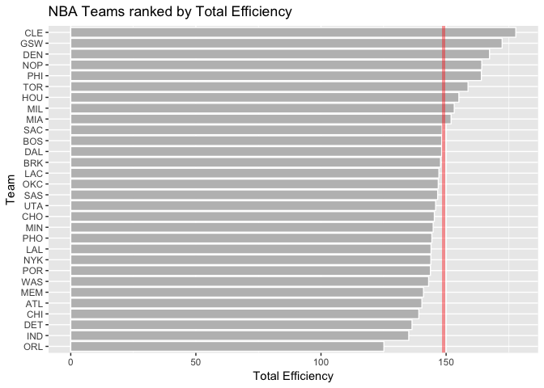

hw03-Jenny-Huang
================
Jenny Huang
10/9/2017

``` r
setwd("~/Desktop/stat133/stat133-hws-fall17/hw03")
library(readr)
library(dplyr)
```

    ## 
    ## Attaching package: 'dplyr'

    ## The following objects are masked from 'package:stats':
    ## 
    ##     filter, lag

    ## The following objects are masked from 'package:base':
    ## 
    ##     intersect, setdiff, setequal, union

``` r
library(ggplot2)
teams <- read.csv("data/nba2017-teams.csv")
```

``` r
#ggplot of ranking teams in salary

ggplot(teams, aes(x = reorder(team,salary), y = teams$salary)) +
  geom_bar(colour = "white", fill = "grey", stat = 'identity') + coord_flip() +
  xlab("Team") + ylab("Salary(in millions)") + ggtitle("NBA Teams ranked by Total Salary") + geom_hline(yintercept = mean(teams$salary), colour = "red", size = 1.4, alpha = 0.4)
```


``` r
#ggplot of ranking teams in total points

ggplot(teams, aes(x = reorder(team,points), y = teams$points)) +
  geom_bar(colour = "white", fill = "grey", stat = 'identity') + coord_flip() +
  xlab("Team") + ylab("Total Points") + ggtitle("NBA Teams ranked by Total Points") + geom_hline(yintercept = mean(teams$points), colour = "red", size = 1.4, alpha = 0.4)
```


``` r
#ggplot of ranking teams in total efficiency

ggplot(teams, aes(x = reorder(team,efficiency), y = teams$efficiency)) +
  geom_bar(colour = "white", fill = "grey", stat = 'identity') + coord_flip() +
  xlab("Team") + ylab("Total Efficiency") + ggtitle("NBA Teams ranked by Total Efficiency") + geom_hline(yintercept = mean(teams$efficiency), colour = "red", size = 1.4, alpha = 0.4)
```



The obtained rankings show that Cleveland Cavaliers has the highest salary and efficiency in general, while Golden State Warriors scores the most points and has the second highest efficiency. While more than half of teams score higher than the average,only 12 teams have the total salary higher than the average, and only 9 teams have total efficiency higher than the average.

``` r
# PCA
teams_pca <- select(teams, c("points3","points2","free_throws","off_rebounds",
                             "def_rebounds", "assists","steals","blocks",
                             "turnovers","fouls"))
pca <- prcomp(teams_pca, scale. = TRUE)
eigs <- data.frame(
  eigenvalue = round(pca$sdev^2,4),
  prop = round(pca$sdev^2 / sum(pca$sdev^2),4),
  cumprop = round(cumsum(pca$sdev^2 / sum(pca$sdev^2)),4)
)
eigs
```

    ##    eigenvalue   prop cumprop
    ## 1      4.6959 0.4696  0.4696
    ## 2      1.7020 0.1702  0.6398
    ## 3      0.9795 0.0980  0.7377
    ## 4      0.7717 0.0772  0.8149
    ## 5      0.5341 0.0534  0.8683
    ## 6      0.4780 0.0478  0.9161
    ## 7      0.3822 0.0382  0.9543
    ## 8      0.2603 0.0260  0.9804
    ## 9      0.1336 0.0134  0.9937
    ## 10     0.0627 0.0063  1.0000

``` r
pca.plot <- as.data.frame(pca$x)
pca.plot <- cbind(pca.plot, teams$team)
ggplot(data = pca.plot ,aes(PC1, PC2)) + geom_text(aes(label = pca.plot$team)) + ggtitle ("PCA plot ( PC1 AND PC2)")
```


Index based on PC1
------------------

``` r
pca.plot$s1 <- 100 * ((pca.plot$PC1) - min(pca.plot$PC1))/(max(pca.plot$PC1) - min(pca.plot$PC1))

ggplot(pca.plot, aes(x = reorder(pca.plot$team,s1), y = pca.plot$s1)) +
  geom_bar(colour = "white", fill = "grey", stat = 'identity') + coord_flip() +
  xlab("Team") + ylab("First PC(scaled from 0 to 100)") + ggtitle("NBA Teams ranked by scaled PC1") 
```


Golden State Warriors ranks the highest, and it outscores other teams by a lot.
