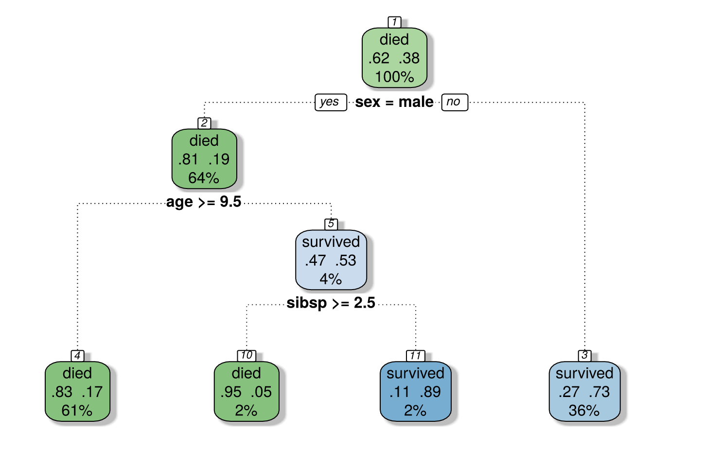
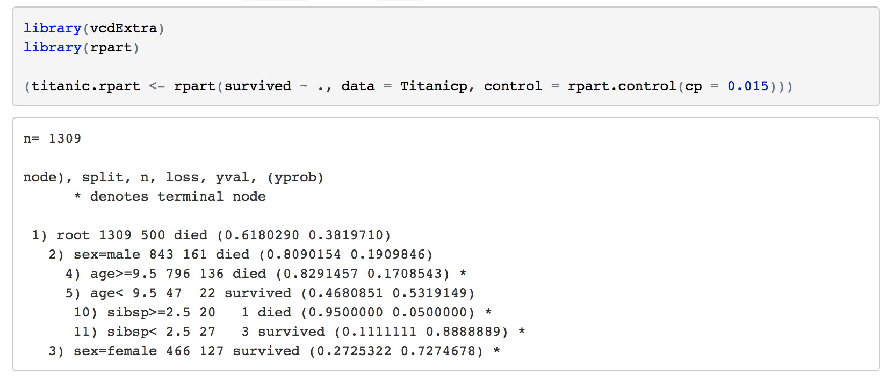

```{r}
#packages I used in this post
library(ggplot2)
library(rpart)
library(party)
library(vcdExtra)
```
### Introduction

The topic I want to talk about is **Tree-based modeling**, and specificallly decision trees, which is one of the methods in Tree-based modeling. Tree-based modeling is especially powerful when it comes to predicting models with high accuracy, stability and ease of interpretation. This type of modeling also maps non-linear relationships perfectly.


#### Background
The general idea of a decision tree is that it uses a tree-like graph of decisions and their possible consequences, to support decision-making. The structure of the tree starts with a single node as its roots, and branches out with decesions made at every node(or branch) of the tree.

#### Some Terminology related to Decision Trees  

- **Root Node**:It represents entire population or sample and this further gets divided into two or more homogeneous sets.  
- **Splitting**: It is a process of dividing a node into two or more sub-nodes.  
- **Decision Node**: When a sub-node splits into further sub-nodes, then it is called decision node.  
- **Leaf/ Terminal Node**: Nodes do not split is called Leaf or Terminal node.  
- **Pruning**: When we remove sub-nodes of a decision node, this process is called pruning. You can say opposite process of splitting. 
- **Branch / Sub-Tree**: A sub section of entire tree is called branch or sub-tree. 
- **Parent and Child Node**: A node, which is divided into sub-nodes is called parent node of sub-nodes where as sub-nodes are the child of parent node.

####  Advantages of Decision Trees

- Insensitive to the scale of features  
- resistant to irrelevant featrues and missing data; and  
- produces a transparent, interpretable table  

#### Example

Below is an example of a decesion tree. It shows the data for passengers on the Titanic. It predicts a passenger's survival chance based on their ticket class, gender, age,number of siblings or spouses aboard, etc. 


One way to interpret this tree is that 62% of the passnegers would have died, and in Male passengers, 81% of them would have died. If we are interested in males who are 9.5 years or older, we follow the branch to the light blue node, which shows that out of the 4% Male passengers who were 9.5 years old or older, they had a 53% probability of surviving, and lastly, the bottom blue node tells us that Male paseengers with number of 2.5 siblings or spouses on board had a 11% chance of surviving.    

The codes for constructing such a table is: 


Since I don't have the Titanic data set myself, I cannot directly run the code chunk in my R studio, but **rpart()** in rpart package provides a numerical representation of the tree, and in order to visaulize the data in a more aesthetic way, we would use **fancyRpartPlot()** to return a beautifully graphed picture like shown above.

#### Another Example with R installed data set
I'm using a data set that comes with R Studio called *iris* to show the codes used for building a decision tree.   
First, let's inspect the data set a little bit.  
```{r}
str(iris)
dim(iris)
head(iris)
table(iris$Species)
```
Some graphs to show the distribution of different species based on different sepal and petal width/length.

```{r}
#Petal.Width vs. Sepal.Width
ggplot(data = iris, aes(iris$Sepal.Width, iris$Petal.Width)) + geom_point(aes(color = Species)) + xlab("Sepal. Width") + ylab("Petal.Width")
```

```{r}
#Petal.Length vs Sepal.Width
ggplot(data = iris, aes(iris$Sepal.Length, iris$Petal.Length)) + geom_point(aes(color = Species)) + xlab("Sepal.Length") + ylab("Petal.Length")
```

```{r}
#Petal.Length vs. Petal.Width
ggplot(data = iris, aes(iris$Petal.Width, iris$Petal.Length)) + geom_point(aes(color = Species)) + xlab("Petal.Width") + ylab("Petal.Length")
```

```{r}
#Sepal.Length vs. Sepal.Width
ggplot(data = iris, aes(iris$Sepal.Width, iris$Sepal.Length)) + geom_point(aes(color = Species)) + xlab("Sepal.Width") + ylab("Sepal.Length")
```
From these four graphs we can kinda grasp some ideas about the three species: Setosa generally has short petal length and sepal length and narrow petal widthVersicolor generally has narrow sepal width, medium petal length, petal width, and sepal length. Virginica generally has wide petal width, long petal length, sepal length, and relatively medium sepal width.   


Then let's create the decision tree using **ctree()**funciton.The first parameter in ctree is a formula that defines a target variable and a list of independent variales. In this case our dependent variable is species, and our independent variables are the rest of the variables in iris.
```{r}
iris_ctree <- ctree(Species ~Sepal.Length + Sepal.Width + Petal.Length + Petal.Width, data = iris)
```

```{r}
print(iris_ctree)
```
Unfortunately I had trouble installing the package "rattle", which would allow me to plot the tree nicely by using **fancyRpartplot()**. Therefore I'm using a different visual representation ( less aesthetic version of fancyrpartplot) of the decision tree.
```{r}
plot(iris_ctree)
```
A simpler version
```{r}
plot(iris_ctree, type = "simple")
```
This decision table predicts the species of a single input of iris based on its sepal length, sepal width, petal length and petal width. 

### Take-home Message
Decision tree is widely used in Machine Learning and Data Mining. Some examples of use of decision tree are - predicting whether the tested drug is effective or not, prediciting the quality and risk of a bond, and predicting of a tumor is cancerous or not.As the advantages of using decision tree stated above, decision tree is easy to interpret, applicable to non liner models, and requires little effort from users for data preparation.


### Reference   
- Analytic Vidhya Content Team, A Complete Tutorial on Tree Based Modeling from Scratch(in R & Python) <https://www.analyticsvidhya.com/blog/2016/04/complete-tutorial-tree-based-modeling-scratch-in-python/#one> 
- Dave Tang, Building a classification tree in R <https://davetang.org/muse/2013/03/12/building-a-classification-tree-in-r/>  
- wikibooks, Data Mining Algorithms In R/Classification/Decision Trees <https://en.wikibooks.org/wiki/Data_Mining_Algorithms_In_R/Classification/Decision_Trees> 
- rpart package: <https://cran.r-project.org/web/packages/rpart/index.html> 
- party package:<https://cran.r-project.org/web/packages/party/party.pdf> 
- vcdExtra package:<https://cran.r-project.org/web/packages/vcdExtra/index.html>

